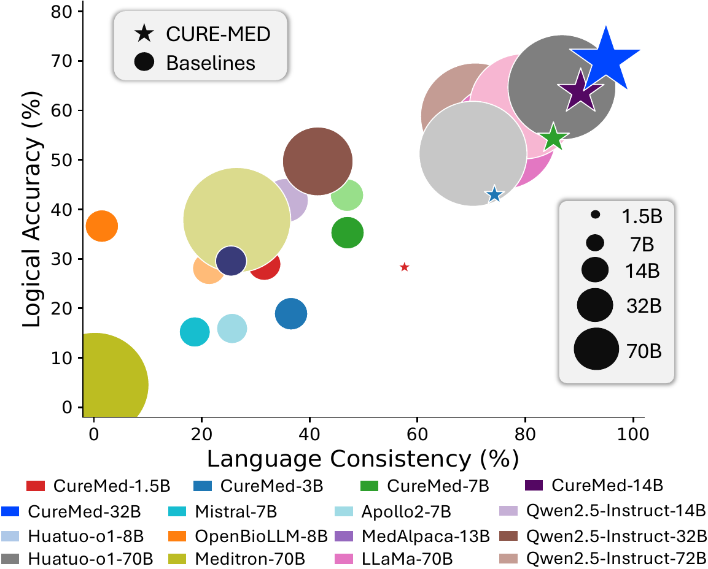

  <h1>CURE-Med: Curriculum-Informed Reinforcement Learning for Multilingual Medical Reasoning</h1>

  
<em>by</em>

  <table>
    <tr>
      <td align="center" style="padding: 0 16px;">
        <strong>Eric Onyame</strong>* 
        University of Virginia
      </td>
      <td align="center" style="padding: 0 16px;">
        <strong>Akash Ghosh</strong>* 
        IIT-Patna
      </td>
      <td align="center" style="padding: 0 16px;">
        <strong>Subhadip Baidya</strong> 
        IIT-Patna
      </td>
      <td align="center" style="padding: 0 16px;">
        <strong>Sriparna Saha</strong> 
        IIT-Patna
      </td>
      <td align="center" style="padding: 0 16px;">
        <strong>Xiuying Chen</strong> 
        MBZUAI
      </td>
      <td align="center" style="padding: 0 16px;">
        <strong>Chirag Agarwal</strong> 
        University of Virginia
      </td>
    </tr>
  </table>

  
*Equal contribution. <strong>Corresponding authors:</strong> Eric Onyame, Akash Ghosh

 

This repository hosts the codebase and dataset for <strong>CURE-Med</strong>, a framework for improving multilingual medical reasoning in large language models (LLMs). Below, we provide an overview of the project along with key training and implementation details.

## Overview
Large language models (LLMs) perform strongly on monolingual math and commonsense reasoning, but they remain unreliable for multilingual medical reasoning—limiting safe use in real-world, multilingual healthcare settings. To address this, we introduce <strong>CUREMED-BENCH</strong>, a high-quality multilingual medical reasoning benchmark of open-ended questions with a single verifiable answer, spanning 13 languages, including under-represented languages such as Amharic, Yoruba, and Swahili. Building on this benchmark, we propose <strong>CURE-MED</strong>, a curriculum-informed reinforcement learning framework that combines code-switching-aware supervised fine-tuning with Group Relative Policy Optimization to improve both logical correctness and language stability. Across 13 languages, CURE-MED consistently outperforms strong baselines and scales effectively, reaching 85.21% language consistency and 54.35% logical correctness at 7B parameters, and 94.96% language consistency and 70.04% logical correctness at 32B parameters. Overall, our results move toward more reliable and equitable multilingual medical reasoning with LLMs.

## Key Figures

  
   
  <em><strong>Figure 1.</strong> The CURE-MED pipeline for multilingual medical reasoning: (A) curated clinically validated multilingual data enables cross-lingual reasoning, (B) supervised fine-tuning on code-switched reasoning traces, and (C) GRPO-guided curriculum RL trained progressively from high- to mid- to low-resource languages for improved correctness and language consistency.</em>

<table align="center">
  <tr>
    <td align="center" width="50%">
      
       
      <em><strong>Figure 2.</strong> Trade-off between language consistency and logical accuracy across models and scales. CURE-MED shifts performance toward the upper-right.</em>
    </td>
    <td align="center" width="50%">
      
       
      <em><strong>Figure 3.</strong> Scaling trends on language consistency (left) and logical accuracy (right): CURE-MED consistently improves over the base model, with gains increasing at larger scales.</em>
    </td>
  </tr>
</table>

  
    High-resolution PDFs:
    <a href="figures/cure_med.pdf">Figure 1</a> ·
    <a href="figures/bubble_plot.pdf">Figure 2</a> ·
    <a href="figures/scaling_plots_with_shaded_bands.pdf">Figure 3</a>
  

For full details, see the paper (to be added).

## Citation
If you find this work useful, please cite: (to be added)

## Dataset
- **CUREMED-BENCH**: Included in `data.zip`. This dataset features open-ended medical reasoning queries with a single verifiable answer across 13 languages. Unzip it for use in training and evaluation scripts.

